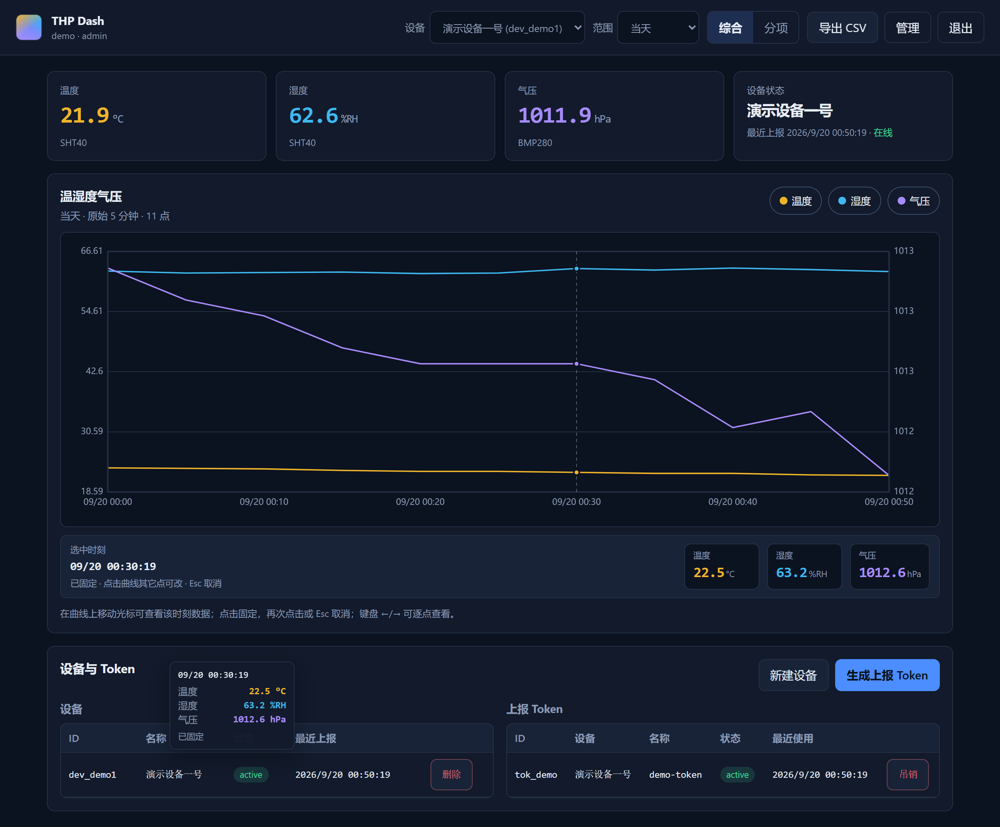

# THP Dash（Cloudflare 服务端 + Dash）

ESP32-C3 温湿度气压监控：**CF Worker API + D1 + Pages Dash + 设备端固件**。  

云端服务与 Web Dash 见本目录；**ESP32-C3 上报固件**见 [ESP32/](./ESP32/)。

## 架构

```
ESP32-C3 (SHT40 + BMP280)  [固件：ESP32/]
    │  HTTPS POST /api/v1/readings
    │  Authorization: Bearer <device_token>
    ▼
Cloudflare Worker ── D1 (readings 永久保留)
    ▲
Pages Dash（自建登录会话 Cookie）
    设备选择 / 当天默认·可选范围 / 综合·分项图 / CSV / Token 管理
```

## 界面预览

桌面端 Dash（1280px，演示模式：当前值卡片、综合三线图、选中时刻拾取、设备与 Token 管理）：



## 目录

| 路径 | 说明 |
|------|------|
| `schema.sql` | D1 表结构（users/sessions/devices/api_tokens/readings） |
| `wrangler.jsonc` | Worker + D1 + 静态资源绑定（`database_id` 部署前需回填） |
| `src/` | Worker 源码（鉴权、上报、查询、降采样、CSV） |
| `public/` | Dash（`index.html` + `css` + `js`），含本地演示模式 |
| `desktop-1280.png` | Dash 桌面端界面预览（README「界面预览」） |
| `REQUIREMENTS.md` | 完整需求、已拍板决策与实现状态 |
| `src/lib/schema.js` | Worker 内幂等 DDL（缺表时自动建表） |
| `tools/submit_readings.py` | 模拟设备上报（测试 Token / 回填曲线） |
| `tools/local_e2e.py` | 本地登录→建设备→Token→上报 冒烟 |
| `tools/test_export_strategy.mjs` | 降采样/导出策略纯函数单测（无需 D1） |
| `tools/test_load_series_mock.mjs` | `loadSeries` 安全护栏 mock 单测（无需 wrangler） |
| `ESP32/` | ESP32-C3 固件（SHT40+BMP280 → HTTPS 上报），见 [ESP32/README.md](./ESP32/README.md) |

## 功能对照

- **设备上报** `POST /api/v1/readings`：Bearer Token；字段 temperature / humidity / pressure（+可选 measured_at、rssi）
- **人侧 API**：登录后会话 Cookie；**全部业务接口鉴权**
- **自建登录**：用户名密码（PBKDF2-SHA256，Workers 上限 100000 迭代），会话 1 天滑动续期；**不用 Cloudflare Access**
- **首次引导**：`GET/POST /api/auth/bootstrap` 创建第一个 admin；`POST /api/auth/migrate` 幂等建表
- **Token**：Dash 内生成/吊销；明文仅一次；库中只存哈希；**已吊销可再删除记录**（`DELETE …?purge=1`）
- **查询** `GET /api/v1/readings`：默认当天，自动降采样；`GET /api/v1/latest` 提供当前值 + 在线状态
- **导出** `GET /api/v1/export`：CSV 列 `timestamp,temperature,humidity,pressure`（UTF-8 BOM）；范围与当前选择一致（单设备）；**先 COUNT，再自动粒度**；超限/SQL 失败时**自动降一档**，不会为导出把长范围原始点整表拉进 Worker；响应头 `x-thp-coarsened=1` 表示已降采样
- **Dash**：综合三线一张 ↔ 分项三张；多设备；管理面板；**光标/点击查看曲线上任一时刻数据**
- **Dash 交互增强（超出需求基线，已实现）**：时间轴**滚轮/双指缩放**、放大后**拖动平移**、「重置缩放」、图表**全屏**；离线阈值 **10 分钟**（2×上报周期）

## 部署（Cloudflare）

### 1. 准备

- 安装 Node.js 18+
- `npx wrangler login`（或本机已登录 Wrangler）

### 2. 创建 D1

```powershell
npx wrangler d1 create thp-dash
```

将输出的 `database_id` 填入 `wrangler.jsonc` 的 `d1_databases[0].database_id`。

### 3. 建表

```powershell
# 本地（wrangler dev）
npx wrangler d1 execute thp-dash --file=./schema.sql --local

# 线上
npx wrangler d1 execute thp-dash --file=./schema.sql --remote
```

### 4. 部署到 Cloudflare

```powershell
# 前提：wrangler.jsonc 中 d1_databases[0].database_id 已是真实 id（当前仍为占位符时 deploy 会失败）
npm run deploy
npm run db:remote
```

部署后首次访问站点创建 admin，再按「本地调试」中的步骤配置设备与 Token。

> **当前状态**：`wrangler.jsonc` 的 `database_id` 仍是 `REPLACE_WITH_YOUR_D1_DATABASE_ID`。本地开发不依赖它；要上生产请先 `npx wrangler d1 create thp-dash` 并回填。

### 5. 设备上报（概念）

```http
POST /api/v1/readings
Authorization: Bearer thp_<secret>
Content-Type: application/json

{
  "temperature": 23.4,
  "humidity": 48.2,
  "pressure": 1013.2,
  "measured_at": "2026-01-01T12:00:00.000Z"
}
```

- 温湿度口径 **SHT40**，气压 **BMP280**  
- **支持部分上报**：仅 `{temperature,humidity}` 或仅 `{pressure}`；缺省字段为 SQL `NULL`，图表/CSV 显示为空缺  
- `temperature` 与 `humidity` 必须同时出现（同源）；至少一组有效字段  
- 缺省字段必须 **省略** 或为 `null`；空串 / 布尔 / 数组会被拒绝（避免 `Number("")===0` 误入库）  
- `device_id` 以 Token 绑定为准  

## API 一览

| 方法 | 路径 | 鉴权 |
|------|------|------|
| GET | `/api/health` | 无（存活探测） |
| GET/POST | `/api/auth/bootstrap` | 无（仅库内无用户时可创建） |
| POST | `/api/auth/migrate` | 库内无用户时开放；已有用户需 **admin + CSRF** |
| POST | `/api/auth/login` | 无 |
| POST | `/api/auth/logout` | 会话 + CSRF |
| GET | `/api/auth/me` | 会话 |
| GET/POST | `/api/v1/devices` | 会话（POST 需 admin） |
| DELETE | `/api/v1/devices/:id` | 会话 + admin |
| GET/POST | `/api/v1/tokens` | 会话（POST 需 admin） |
| DELETE | `/api/v1/tokens/:id` | 会话 + admin（吊销） |
| DELETE | `/api/v1/tokens/:id?purge=1` | 会话 + admin（硬删除已吊销记录） |
| POST | `/api/v1/readings` | **设备 Token** |
| GET | `/api/v1/readings?device_id&from&to` | 会话 |
| GET | `/api/v1/latest?device_id=` | 会话 |
| GET | `/api/v1/export?device_id&from&to` | 会话 |

写操作（登录后的 POST/DELETE）需请求头 `X-CSRF-Token`（Dash 自动从 Cookie `thp_csrf` 带上）。

---

## 本地调试（Windows / wrangler dev）

本地开发**不需要** Cloudflare 账号、真实 `database_id`，也不连线上 D1。

### 原理

| 项目 | 本地行为 |
|------|----------|
| Worker | `wrangler dev` 在本机跑 Miniflare/workerd |
| D1 | 项目下 SQLite 文件：`.wrangler/state/v3/d1/miniflare-D1DatabaseObject/...` |
| 静态 Dash | `public/` 由 Worker Assets 提供，同源访问 `/api/*` |
| `wrangler.jsonc` 中的 `database_id` | **本地可保持占位符**；仅 `deploy` / `--remote` 需要真实 id |

本地 D1 与线上完全隔离：删掉 `.wrangler/` 等于清空本地库，不会影响线上。

### 标准流程（从零到能看图）

在项目根目录 `G:\esp32s3\esp32c3_sensors-THP-dash`：

```powershell
# 0) 进入 Node 环境（本仓库自带；若 PATH 已有 node/npm 可跳过）
. .\node_env.ps1

# 1) 安装依赖（首次）
npm install

# 2) 对【本地】D1 建表（必须；否则 no such table: users）
npm run db:local

# 3) 启动本地服务
npm run dev
# 等价：npx wrangler dev --local
# 指定端口：npx wrangler dev --local --ip 127.0.0.1 --port 8787
```

终端出现 `Ready on http://127.0.0.1:8787` 后，用浏览器打开该地址：

1. 首次进入 **初始化** 页 → 创建 admin 用户名/密码（≥8 位）  
2. 自动或手动 **登录** 进入 Dash  
3. **管理** → **新建设备**（如 `dev_lab1` + 名称）  
4. **生成上报 Token** → 明文**只显示一次**，先保存  
5. 选择设备与时间范围，查看综合/分项曲线、当前值  
6. **导出 CSV**、吊销 Token 等均可本地联调  

### npm 脚本

| 脚本 | 命令展开 | 用途 |
|------|----------|------|
| `npm run db:local` | `wrangler d1 execute thp-dash --file=./schema.sql --local` | 本地建表 |
| `npm run db:remote` | 同上 `--remote` | 线上建表 |
| `npm run db:tables` | 查本地 `sqlite_master` | 列出本地 D1 表 |
| `npm run dev` | `wrangler dev` | 本地开发服务 |
| `npm run deploy` | `wrangler deploy` | 部署 Worker（需先回填真实 `database_id`） |
| `npm run check` | `node --check` 全部 `src/` + `public/js` | 源码语法检查（已通过） |
| `npm run test:downsample` | `node tools/test_export_strategy.mjs` | 降采样/导出策略单测（无需 D1） |
| `npm run test:loadseries` | `node tools/test_load_series_mock.mjs` | `loadSeries` 安全护栏 mock 单测 |
| `npm run test:unit` | 上述两项 | 离线单元测试 |

### 单元测试（不启 Worker）

```powershell
. .\node_env.ps1
npm run test:unit
```

覆盖：时间范围 → 粒度阶梯、行数上限自动降档、SQL 失败时的安全回退、避免整表拉原始点等。本地 E2E 仍用 `python tools/local_e2e.py`（需 `npm run dev`）。

### 本地 HTTP 探测（PowerShell）

服务启动后另开一个终端：

```powershell
# 存活
Invoke-RestMethod http://127.0.0.1:8787/api/health

# 是否需要创建第一个用户（false=已有用户）
Invoke-RestMethod http://127.0.0.1:8787/api/auth/bootstrap

# Dash 是否可访问
(Invoke-WebRequest http://127.0.0.1:8787/ -UseBasicParsing).StatusCode
```

**手动建表（不依赖页面）：**

```powershell
Invoke-RestMethod -Method POST http://127.0.0.1:8787/api/auth/migrate
```

**创建 admin（引导接口，仅库内无用户时可用）：**

```powershell
$body = @{ username = 'admin'; password = 'change-me-now' } | ConvertTo-Json
Invoke-RestMethod -Method POST http://127.0.0.1:8787/api/auth/bootstrap -ContentType 'application/json' -Body $body
```

**登录并保存 Cookie（后续带 Cookie + CSRF 调业务 API）：**

```powershell
$session = New-Object Microsoft.PowerShell.Commands.WebRequestSession
$login = Invoke-RestMethod -Method POST http://127.0.0.1:8787/api/auth/login `
  -ContentType 'application/json' -WebSession $session `
  -Body (@{ username='admin'; password='change-me-now' } | ConvertTo-Json)
$csrf = $login.csrf
Invoke-RestMethod http://127.0.0.1:8787/api/auth/me -WebSession $session
Invoke-RestMethod http://127.0.0.1:8787/api/v1/devices -WebSession $session
```

**模拟设备上报（需先在 Dash 生成 Token）：**

```powershell
# 推荐：Python 测试脚本（标准库，无需 pip）
python tools/submit_readings.py --health
python tools/submit_readings.py --token thp_粘贴明文 --count 3 -v
python tools/submit_readings.py --token thp_xxx --backfill-hours 24 --interval-min 5
python tools/submit_readings.py --token thp_xxx --loop --interval 30
# 或手动 Invoke-RestMethod：
Invoke-RestMethod -Method POST http://127.0.0.1:8787/api/v1/readings `
  -Headers @{ Authorization = "Bearer thp_xxx" } `
  -ContentType 'application/json' `
  -Body '{"temperature":23.5,"humidity":48.2,"pressure":1013.2}'
```

**查询曲线 / 导出 CSV：**

```powershell
# 需已登录（-WebSession $session）并带上 $csrf 时写操作才需要
Invoke-RestMethod "http://127.0.0.1:8787/api/v1/readings?device_id=dev_lab1" -WebSession $session
Invoke-WebRequest "http://127.0.0.1:8787/api/v1/export?device_id=dev_lab1" -WebSession $session -OutFile thp_export.csv
```

### 本地 SQL（wrangler d1 --local）

```powershell
# 列出本地表
npx wrangler d1 execute thp-dash --local --command "SELECT name FROM sqlite_master WHERE type='table' ORDER BY name"

# 设备与 Token
npx wrangler d1 execute thp-dash --local --command "SELECT id,name,status,last_seen_at FROM devices"
npx wrangler d1 execute thp-dash --local --command "SELECT id,device_id,revoked_at FROM api_tokens"

# 最近读数
npx wrangler d1 execute thp-dash --local --command "SELECT ts,temperature,humidity,pressure FROM readings ORDER BY ts DESC LIMIT 10"

# 用户数 / 会话数
npx wrangler d1 execute thp-dash --local --command "SELECT (SELECT COUNT(*) FROM users) AS users, (SELECT COUNT(*) FROM sessions) AS sessions"
```

### 演示模式（不启 Worker）

只想看 UI、不连 API 时：

1. 用浏览器直接打开 `public/index.html`，或  
2. 在已部署/本地站点 URL 后加 `?demo=1`  

登录页出现后点击 **演示模式**：使用 `public/js/demo.js` 的本地模拟数据（设备、约 24h 曲线、假 Token、CSV 下载）。  
**不会**写入 D1，也不能验证真实鉴权/上报。

### 常见问题

| 现象 | 原因 | 处理 |
|------|------|------|
| `no such table: users` | 本地 D1 未建表 | `npm run db:local`；或 `POST /api/auth/migrate`；bootstrap 路径也会自动补建 |
| `Binding DB not found` / 配置错误 | `wrangler.jsonc` 未正确加载或未在项目根执行 | 在项目根运行 `npm run dev`；确认存在 `d1_databases` 且 `binding: "DB"` |
| 端口被占用 | 8787 已被占用 | `npx wrangler dev --local --port 8788` |
| 登录 401「用户名或密码错误」 | 未引导创建用户，或密码不对 | `GET /api/auth/bootstrap` 看 `needsBootstrap`；必要时清本地库后重建 admin |
| 页面能开但接口 401 | 未登录或会话过期 | 重新登录；写操作需 Dash 自动带的 `X-CSRF-Token` |
| 上报 401 | Token 错误/已吊销 | 在 Dash 重新生成 Token |
| 上报 400 | 字段超范围 | 温度 −40–85°C，湿度 0–100%，气压 300–1200 hPa |
| 改了 `schema.sql` 本地表没变 | DDL 不会自动重放 | 手动再执行 `npm run db:local`，或删 `.wrangler` 后重建（本地数据会清空） |
| 想重置本地数据 | — | 停止 `wrangler dev` → 删除 `.wrangler/` → `npm run db:local` → 重新引导 admin |
| 线上 deploy 报 D1 id 无效 | 仍是占位符 | `wrangler d1 create thp-dash` 后把真实 id 写入 `wrangler.jsonc`，再 `db:remote` |


---

### 图表交互

| 操作 | 行为 |
|------|------|
| 鼠标在曲线上移动 | 十字线吸附最近采样点，浮动提示显示该时刻温湿度气压 |
| 点击 | **固定**选中点，图下方「选中时刻」读数条持续显示 |
| 再次点击同一点 / Esc | 取消固定（图表全屏时 Esc 先退出全屏） |
| 键盘 ←/→（画布聚焦时） | 逐点查看；Home/End 到首尾 |
| 滚轮 / 触控板 / 双指捏合 | **缩放时间轴**（可放大到约 1–2 个采样间隔） |
| 放大后横向拖动 | **平移**可见时间窗；双击不重置缩放 |
| 「重置缩放」按钮 / 键盘 `0`/`R` | 恢复完整时间范围 |
| 「全屏」按钮 | 图表全屏查看（原生 Fullscreen + CSS 兜底） |
| 分项图 | 任一子图悬停/点击/缩放，三图十字线与读数条同步 |

## 自动降采样（v1）

| 范围 | 粒度 |
|------|------|
| ≤ 24h（含当天） | 原始 5 分钟 |
| ≤ 7 天 | 30 分钟 |
| ≤ 30 天 | 2 小时 |
| ≤ 90 天 | 6 小时 |
| ≤ 1 年 | 1 天 |
| > 1 年 | 1 周 |

原始数据 **永久** 存于 D1；降采样仅作用于读路径（曲线与 CSV 一致）。

## 安全要点

- 密码：PBKDF2-SHA256（迭代 100000，Workers WebCrypto 上限）  
- 设备 Token / 会话：只存 SHA-256 哈希  
- 会话 Cookie：HttpOnly + Secure + SameSite=Lax  
- 会话 **滑动续期** 1 天（每次鉴权延长 `expires_at` 并刷新 Cookie `Max-Age`）  
- 登录失败限速（Cache API，窗口 15 分钟，尽力而为）  
- Token 明文仅生成响应中出现一次  
- CORS：默认仅同源；跨域 Dash 用环境变量 `ALLOWED_ORIGINS`（逗号分隔完整 origin）  
- 长范围查询/导出在 **SQL 侧** 自动降采样（失败时回退内存聚合）  

## ESP32-C3 固件（已交付，本机已构建）

固件工程在 [`ESP32/`](./ESP32/)，说明见 [ESP32/README.md](./ESP32/README.md)。

- 框架：ESP-IDF（sht40 bmp280）
- 口径：SHT40 → 温度/湿度；BMP280 → 气压（BMP 内部温度不入库）
- 部分上报：允许仅温湿度或仅气压；JSON 省略缺失字段；云端列为可空
- 节奏：默认 5 分钟 HTTPS `POST /api/v1/readings` + Bearer Token
- 配置：`ESP32/main/thp_config.h`（Wi-Fi / API Base / Token，**不入库**；仓库仅 `.example`）
- 重试：网络与 5xx 有限退避；401/403/400 不重发
- TLS：内嵌 Cloudflare 所用 GTS 根证书（`main/thp_tls_trust.h`），并关闭 IPv6 规避 AAAA 连不通
- 本机构建：`ESP32/build/esp32c3_thp_report.bin` 与 `esp32c3_thp_report_flashed.bin` 已生成（2026-09）
- 前置：Dash 新建设备并生成 Token；本地 dev 时 `THP_API_BASE` 须为电脑局域网 IP；上生产须改为线上 Worker 域名并重新烧录

更细的硬件、烧录与协议说明见 `ESP32/README.md`

## 许可证

见 `LICENSE`。
